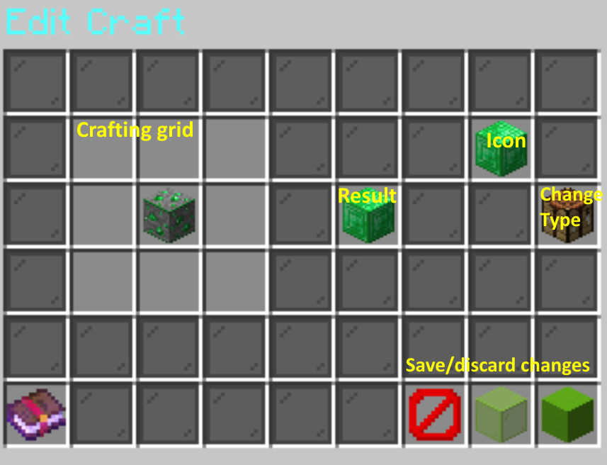
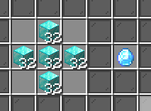

# GreatCrafts

GreatCrafts is a crafting recipe plugin that allows you to create and customize your own crafting table recipes.

## Features

- Supports shaped and shapeless recipes
- Supports exact NBT matching, customizable for each ingredient item
- Supports multiple choices for an ingredient (e.g., any type of wood plank)
- Adds **stacked item recipes**, which require stacks of ingredients
  - This allows you to require up to 576 ingredients to craft a single item
- Has a simple to use GUI for both players and admins

## Commands

`/recipes` - Opens a menu of all custom recipes (can be used by all players)

`/viewrecipe <namespace:name>` - View the crafting grid for a recipe (can be used by all players)

`/addrecipe <namespace:name>` - Add a new custom recipe

`/editrecipe <namespace:name>` - Edit a custom recipe

`/reloadrecipes` - Reloads any changes to recipes (if they weren't already reloaded/activated already)

## Creating/editing recipes

Run `/addrecipe <craft>` or `/editrecipe <craft>`.
For the `<craft>` argument, include both the namespace and name, for example `myspecialnamespace:mycustomcraft`.

Place the items in the 3x3 crafting grid to the left, the result slot in the middle, and the icon slot (used to label the craft in the `/recipes` menu) in the top right.
You can put stacks of items or items with NBT in the ingredients and they will be saved, but players will only have to match the item type unless you enable exact choice and/or stacked items.

For each ingredient, you can also enable exact choice or material choice.
Exact choice requires an exact match of NBT data (e.g., an item with a specific name or an item with specific enchantments), and material choice allows one of any item type to be used (e.g., any type of plank).
Shift left click on an ingredient to toggle exact choice, and shift right click to toggle material choice.

Click on the crafting table to the right to change the type of the recipe:
- Shaped (most recipes in the game; shape of the grid matters)
- Shapeless (the ingredients can be in any order)
- Stacked items (require stacks of ingredients in each slot instead of just a single item)

Finally, click the barrier block to discard your changes, the green glass to save your changes, or the green concrete to save and activate your changes.
Activating your changes makes the craft available to players immediately, although the client doesn't recognize the craft until you disconnect and reconnect.

## Viewing recipes

`/recipes` shows all recipes available to the player, and clicking on a recipe will show the crafting grid for that recipe.

`/viewrecipe <namespace:name>` shows the crafting grid for a specific recipe.

## Stacked items

Stacked items are a special type of recipe that require stacks of each ingredient instead of just 1 of each.
In the example shown, it would take 160 diamond blocks to make 1 enchanted diamond.
(Players will get an error message if they try to craft it with fewer diamond blocks.)

Creating them is the same process; just put stacks of items in the crafting grid.
Make sure to also click on the crafting table on the right to change the recipe type to stacked items.

These can also be combined with exact and material choice the same way as before, so if you're really mean you can require 160 enchanted diamonds to make an enchanted diamond block...
